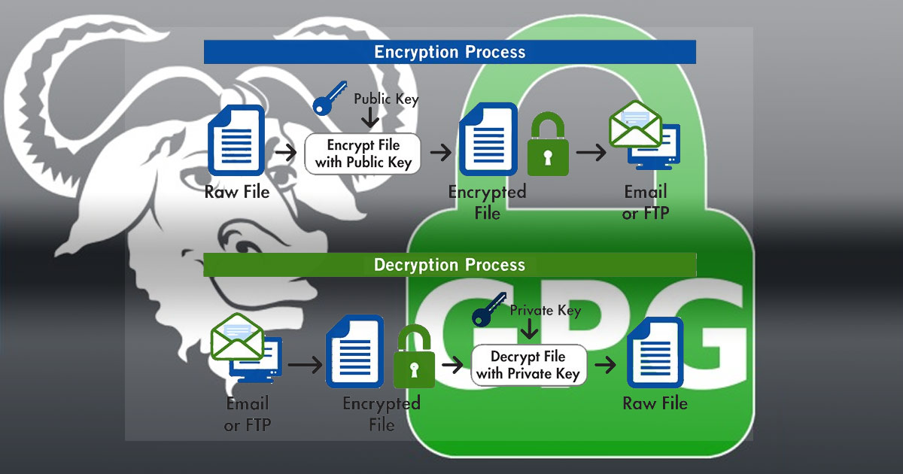
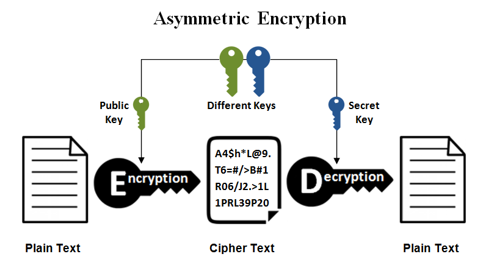

# A Guide to GPG and Encryption



## What is GPG ?
[GPG](https://www.gnupg.org/) ( GNU Privacy Guard ) is an implementation of [OpenPGP](https://www.openpgp.org/) used for:
- Encrypting data (files, messages)
- Digitally signing stuff (prove it's really you)
- Managing public/private key pairs

GPG uses [asymmetric encryption](https://www.ibm.com/think/topics/asymmetric-encryption) which means that you'll generate two keys:
- Public Key which encrypt data and can be shared
- Private Key which decrypt data and is private and can't be shared



## Using GPG to Encrypt data

### Installing GPG

On most Linux system gpg is already installed and you can check it via
```
gpg --version
```

But if it is not installed in your operating system then you can just google it: `How to install gpg on <your-operating-system>` replace `<your-operating-system>` with the OS you uses and it will show you steps on how to install GPG.

### Generate Key Pair

GPG uses [asymmetric encryption](https://www.ibm.com/think/topics/asymmetric-encryption) so we need to generate the key pair ie. Public Key and the Private Key

```
gpg --full-generate-key
```

The above command is used to generate a new key pair, once you run it will ask you a few questions, which are:

- Key type -> choose default (ECC (sign and encrypt))
- Elliptic curve -> choose default (Curve 25519)
- Expiry -> choose when you want to expiry of key (good practice: 5y or totally depend on you)
- Name & Email -> for your identity
- Passphrase -> Choose a strong one as it protects your private key

Once you successfully generate the keys, you can list your keys using:

```
gpg --list-keys
```

Output should be something like this:

```
pub   ed25519 2026-04-10 [SC] [expires: 2036-04-07]
      8asfgasgasgaEC413sagasdgsdagasasdgC2DCB41700
uid           [ultimate] John Doe (GPG key for thinkpad t480) <doejohn@gmail.com>
sub   cv99152 2026-04-10 [E] [expires: 2036-04-07]
```

 YAY 🥳 🙌 🎉 👏 🤩, You've successfully generated your gpg key pair.
 
 ### Sharing your Public Key

To encrypt a message or data for you, someone needs your public key to encrypt the data with that so you can only decrypt it via your private key, in order to do this, we need to export our public key to share it with other, to do that we use this command:
 
```
gpg --armor --export your@email.com > mykey.asc
```

__Note:__ Replace `your@email.com` with the email you used while creating the gpg key.

Now you Public Key is written in `mykey.asc` and you can share it with anyone and then they can use it to encrypt the data for you.

### Importing other's Public Key

Now for encrypting data for others, you need to import their public key, to do this we use the command:

```
gpg --import shared-public-key.asc
```

__Note__: You can save the public key in any format and import it but `.asc` is recommended.

Now after importing the public key you can verify that it was added by:

```
gpg --list-keys
```

Once importing the public key, there is a very important step which is to trust the imported public key.
