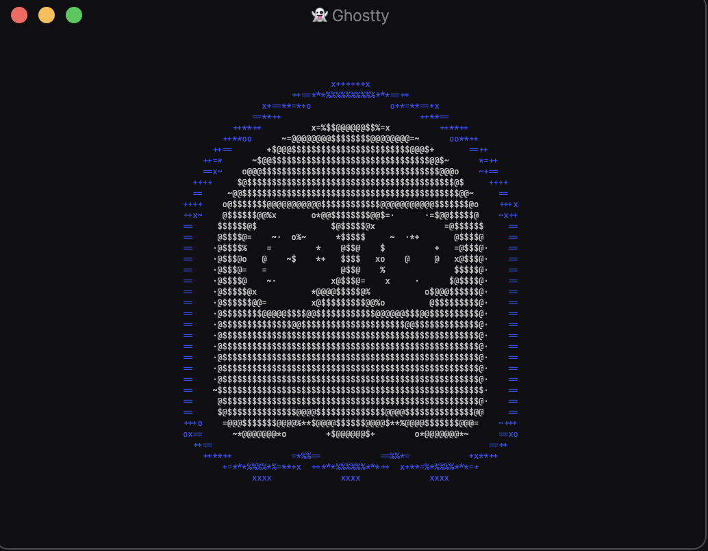
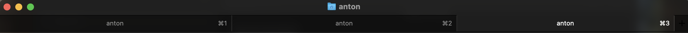

> Why do we want intelligent terminals when there are so many stupid users?



From the start of my computer journey, I always be a fan of terminals, they always amaze me and when I use them, it always feels like a [Hackerman](https://knowyourmeme.com/memes/hackerman) , opening [neofetch](https://en.wikipedia.org/wiki/Neofetch) and [htop](https://htop.dev/) in front of my friend and cousins, fells really cool and they assume that I know some kind of advance computing and [hacking](https://www.fortinet.com/resources/cyberglossary/what-is-hacking#:~:text=A%20commonly%20used%20hacking%20definition,data%20theft%20by%20cyber%20criminals.). I used a lot of [terminal emulator's](https://en.wikipedia.org/wiki/Terminal_emulator) from the native one in MacOS and Linux to [terminator](https://gnome-terminator.org/), [iTerm2](https://iterm2.com/), [hyper](https://hyper.is/), [warp](https://www.warp.dev/) and from these many year's, hopping from one to another, I didn't able to find one, that really fit for my work. Last year I discovered [Zellij](https://zellij.dev/) which is not originally a  [terminal emulator's](https://en.wikipedia.org/wiki/Terminal_emulator) but a [terminal workspace ](https://www.ibm.com/docs/en/om-zvm-linux/4.2.0?topic=SSZJZF_4.2.0/com.ibm.omegamon_xezvm.doc_4.2/SC2728360059.html) , I liked it a lot, and start using it. But it always felt overkilled for me, I didn't use it's 10% of the features in my daily workflow. And sometimes it's feels too complex to use, plus configuring it is not my cup of tea 🫖.


Then around December, I'm just browsing on YouTube, I came across the news that[ Ghosttly had it's public release ](https://github.com/ghostty-org/ghostty/releases/tag/v1.0.0) and it is one of the most hype thing on Tech Youtube and X ( formerly knowns as Twitter ) , So I plan to try it, and it just feels like WOW 🤩, on the first try, I loved it and I really liked it's [Zero Configuration Philosophy](https://ghostty.org/docs/config#zero-configuration-philosophy) and also it was a famous saying in the tech and Open-Source industry that, **"You should never bet against [Mitchell Hashimoto ](https://mitchellh.com/)."**  

## About [Ghostty](https://ghostty.org/)

Ghostty is a cutting-edge terminal emulator that has been making waves in the developer community since its release. Ghostty aims to provide a fast, feature-rich, and cross-platform terminal experience with a focus on native interface design

### Key Features

**Performance**: Ghostty boasts rapid performance and GPU-accelerated rendering, utilizing Metal on macOS and OpenGL on Linux for smooth and responsive operation.

**Cross-Platform Compatibility**: The terminal runs on macOS and Linux, with Windows support planned for the future. It uses native UI components on each platform to provide an idiomatic experience.

**Customization**: Ghostty offers extensive customization options, including themes, fonts, key bindings, and layouts. It ships with hundreds of built-in themes and supports user-created themes.

And the best thing about Ghostty is it `feels like a native emulator` because of its dedication to delivering a truly native experience. Designed for macOS and Linux, it integrates seamlessly with your desktop environment. Ghostty uses platform-specific GUIs - [Swift](https://www.swift.org/) and [SwiftUI](https://developer.apple.com/xcode/swiftui/) on macOS, and [Zig](https://ziglang.org/) with [GTK4](https://docs.gtk.org/gtk4/) on Linux-powered by a shared core written in Zig, "[libghostty](https://github.com/ghostty-org/ghostty)." It leverages native UI components, familiar keyboard/mouse shortcuts, and platform-specific features like Quick Look and secure input API on macOS to ensure it feels intuitive, polished, and perfectly aligned with each platform's conventions.

## My Ghostty configuration

Enough about Ghostty itself-let's dive into how I customized it to suit my workflow and supercharge my productivity in the terminal.

You can get more information about the [configuration](https://ghostty.org/docs/config) , [Option Refence](https://ghostty.org/docs/config/reference) and [Keybindings](https://ghostty.org/docs/config/keybind) for the [docs](https://ghostty.org/docs) of Ghostty.

_Note: These configurations are tailored to fit my workflow and make things easier. You can customize them to suit your needs. My main goal is to show you "How to configure Ghostty."_ 

```
title = "anton"
font-family = "FiraCode Nerd Font Mono Reg"
theme = catppuccin-mocha
font-size = 16
background-opacity = 0.85
background-blur-radius = 20
mouse-hide-while-typing = true
window-height = 30
window-width = 128
window-decoration = true

background = #1e1e1e
foreground = #d4d4d4

keybind = ctrl+alt+z=close_surface
keybind = ctrl+alt+w=close_window
 
keybind = ctrl+alt+n=new_window
keybind = ctrl+alt+t=new_tab

keybind = ctrl+alt+r=new_split:right
keybind = ctrl+alt+d=new_split:down

keybind = ctrl+alt+]=reset_font_size
keybind = ctrl+alt+[=clear_screen

keybind = ctrl+alt+m=toggle_fullscreen
keybind = global:ctrl+alt+f=toggle_quick_terminal
keybind = ctrl+alt+v=toggle_visibility

keybind = ctrl+alt+a>up=scroll_to_top
keybind = ctrl+alt+a>down=scroll_to_bottom
keybind = ctrl+alt+a>left=scroll_page_up
keybind = ctrl+alt+a>right=scroll_page_down

keybind = ctrl+alt+left=goto_split:left
keybind = ctrl+alt+right=goto_split:right
keybind = ctrl+alt+up=goto_split:top
keybind = ctrl+alt+down=goto_split:bottom

keybind = ctrl+alt+;=previous_tab
keybind = ctrl+alt+'=next_tab

keybind = ctrl+alt+q=quit
```

Now you got he `config` for the ghostty, but now where to put it and how it works 🤔.

This is given in the Ghostty [docs](https://ghostty.org/docs/config#zero-configuration-philosophy) and I quote it...

>  The configuration file, `config`, is loaded from these locations in the following order:
>  
>  XDG configuration Path (all platforms):
>  
> 	- `$XDG_CONFIG_HOME/ghostty/config`
> 	- if `XDG_CONFIG_HOME` is not defined, it defaults to
> 		-  `$HOME/.config/ghostty/config`

So now let's look what each line of the configuration does 😊

Before we start we need to learn two shortcuts for Ghostty

- In MacOS
	- `CMD  + , ` - To Open the Configuration file
	-  `CMD + Shift + ,` - To Reload Configuration
- In Linux
	- `Ctrl  + , ` - To Open the Configuration file
	- `Ctrl + Shift + ,` - To Reload Configuration

***


```
title = "anton"
```

This line sets the title for the terminal emulator which shows on the title bar of the Ghostty window.

    
***

```
font-family = "FiraCode Nerd Font Mono Reg"
```

This line help's you to set the theme of the font-family of your Ghostty terminal, there is a lot of options you can choose for the font-family, you can see them using this `ghostty +list-fonts` command.

***

```
theme = catppuccin-mocha
```

This line help's you to set the theme of your Ghostty terminal, there is a lot of options you can choose for the theme, you can see them using this `ghostty +list-themes` command.

***

```
font-size = 16
```

This line sets the size of the font used in the Ghostty terminal. A value of `16` ensures that the text is comfortably readable. You can adjust this value to make the font smaller or larger based on your preference.

***

```
background-opacity = 0.85

```

This line sets the transparency level of the Ghostty terminal's background. A value of `1` makes the background completely opaque, while lower values increase transparency.

***

```
background-blur-radius = 20
```

This line controls how much the background is blurred when the Ghostty terminal is open. The higher the value, the more blurred the background becomes, giving a frosted glass effect.

***

```
mouse-hide-while-typing = true
```

When enabled, this option hides the mouse pointer while you type in the Ghostty terminal. It helps to minimize distractions and keeps the focus on your typing.

***

```
window-height = 30
```

This line specifies the height of the Ghostty terminal window in percentage of the screen height. Here, `30` means the window height will be 30% of your screen height.

***

```
window-width = 128
```

This line sets the width of the Ghostty terminal in characters. A value of `128` ensures the terminal accommodates up to 128 characters in a single row.

***

```
window-decoration = true
```

This line enables or disables the window decorations, such as borders and the title bar. Setting it to `true` means the decorations are visible.

***

```
background = #1e1e1e
```

This line sets the background color of the Ghostty terminal. The color is defined in hexadecimal format, and `#1e1e1e` represents a dark gray shade.

***

```
foreground = #d4d4d4
```

This line sets the text color (foreground) of the terminal. The value `#d4d4d4` represents a light gray shade, ensuring good contrast against the dark background.

These are all the part of the [Option Reference configuration](https://ghostty.org/docs/config/reference) and there are many options like this you can configure easily by reading the Documentation.

## Keybindings

This part of configuration is related to [keybindings](https://www.reddit.com/r/swtor/comments/42rqxt/what_is_keybinding/) ( which means A key, or [key](https://en.wiktionary.org/wiki/key#English "key") combination, which, when pressed, causes something to happen ) and in this case we set many things to happen when we press a key.

_Note: Here `ctrl+alt` are [leader keys](https://www.reddit.com/r/vim/comments/1bveqh1/what_is_a_leader_key/), which means that ( they are the special key that acts as a prefix to trigger a sequence of further keystrokes ) , you can choose you [leader key](https://www.reddit.com/r/vim/comments/1bveqh1/what_is_a_leader_key/)as you want_

***
### Close and Quit Operations

- **`keybind = ctrl+alt+z=close_surface`**  
  Closes the currently active surface (e.g., a floating terminal or dialog).

- **`keybind = ctrl+alt+w=close_window`**  
  Closes the currently active terminal window.

- **`keybind = ctrl+alt+q=quit`**  
  Exits the Ghostty terminal application completely.

---

### Window and Tab Management

- **`keybind = ctrl+alt+n=new_window`**  
  Opens a new terminal window.

- **`keybind = ctrl+alt+t=new_tab`**  
  Opens a new tab in the current terminal window.

---

### Splitting Panes

- **`keybind = ctrl+alt+r=new_split:right`**  
  Splits the current terminal pane vertically, creating a new pane on the right.

- **`keybind = ctrl+alt+d=new_split:down`**  
  Splits the current terminal pane horizontally, creating a new pane below.

---

### Font and Screen Controls

- **`keybind = ctrl+alt+]=reset_font_size`**  
  Resets the terminal font size to its default value.

- **`keybind = ctrl+alt+[=clear_screen`**  
  Clears the terminal screen, removing all previous output.

---

### Fullscreen and Visibility Toggles

- **`keybind = ctrl+alt+m=toggle_fullscreen`**  
  Toggles between fullscreen and windowed mode for the terminal.

- **`keybind = global:ctrl+alt+f=toggle_quick_terminal`**  
  Opens or closes the quick terminal overlay for running quick commands.

- **`keybind = ctrl+alt+v=toggle_visibility`**  
  Toggles the visibility of the terminal window (minimizing or restoring it).

---

### Scrolling Operations

- **`keybind = ctrl+alt+a>up=scroll_to_top`**  
  Scrolls to the top of the terminal output.

- **`keybind = ctrl+alt+a>down=scroll_to_bottom`**  
  Scrolls to the bottom of the terminal output.

- **`keybind = ctrl+alt+a>left=scroll_page_up`**  
  Scrolls up by one page in the terminal output.

- **`keybind = ctrl+alt+a>right=scroll_page_down`**  
  Scrolls down by one page in the terminal output.

---

### Navigating Between Splits

- **`keybind = ctrl+alt+left=goto_split:left`**  
  Moves focus to the terminal pane to the left.

- **`keybind = ctrl+alt+right=goto_split:right`**  
  Moves focus to the terminal pane to the right.

- **`keybind = ctrl+alt+up=goto_split:top`**  
  Moves focus to the terminal pane above.

- **`keybind = ctrl+alt+down=goto_split:bottom`**  
  Moves focus to the terminal pane below.

---

### Tab Navigation

- **`keybind = ctrl+alt+;=previous_tab`**  
  Switches to the previous tab in the terminal.

- **`keybind = ctrl+alt+'=next_tab`**  
  Switches to the next tab in the terminal.

---

*These configuration make it easy to efficiently navigate and manage the Ghostty terminal. Customize them further if needed to suit your workflow!*

While there are plenty of terminal emulators out there, Ghostty strikes the perfect balance between performance, aesthetics, and functionality. If you’re someone who loves working in the terminal and wants a tool that is powerful yet simple, I’d highly recommend giving Ghostty a try.

Have you tried Ghostty yet? Or do you have a favorite terminal emulator? Let me know I would love to here your thoughts, you can share it to me via my [mail](mailto:itskanishkp.py@gmail.com) —I’d love to hear about your experience!

### Don't forget to show your support by giving a ⭐️ to the [Ghostty GitHub repository](https://github.com/ghostty-org/ghostty). Your stars help the project grow and encourage further development and gives a motivation to the Ghostty Team 👏!

