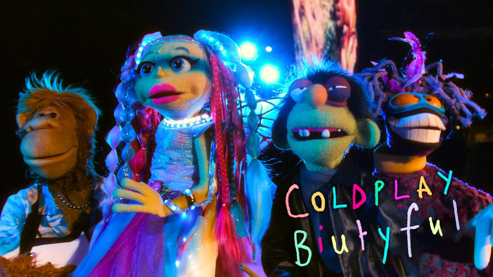
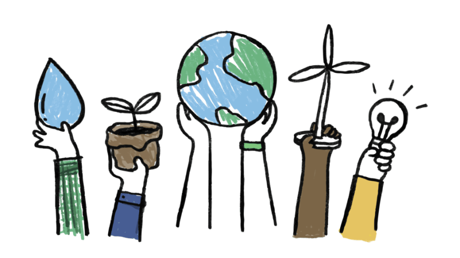
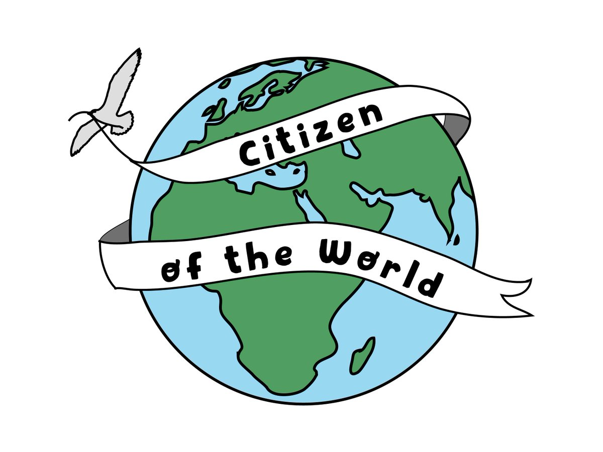
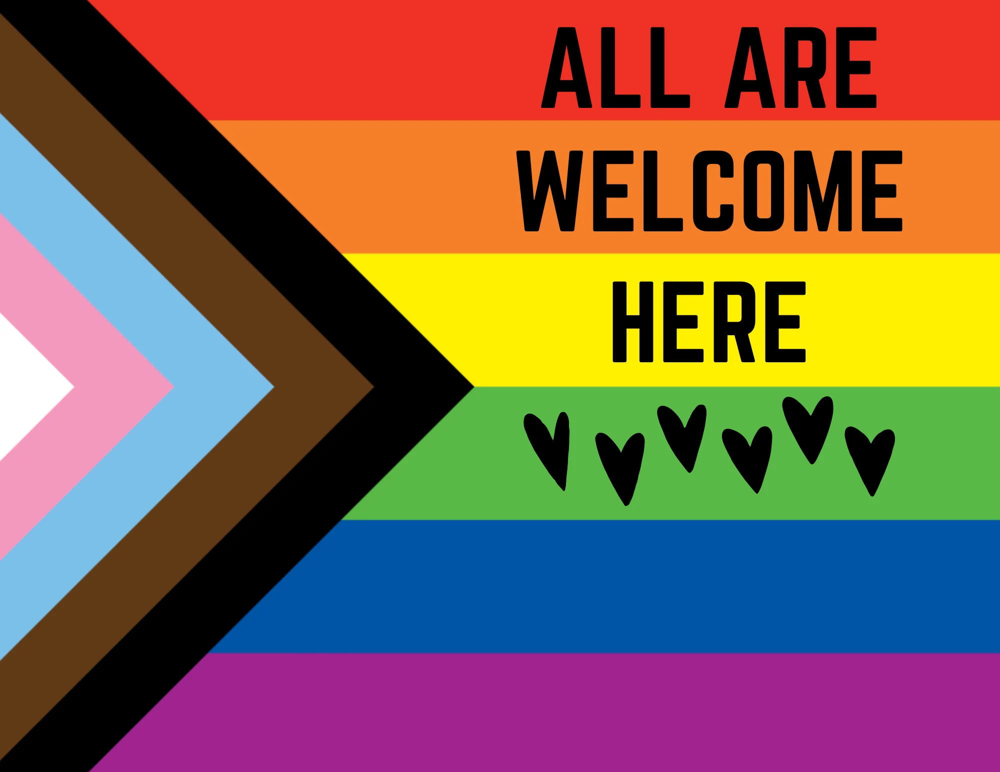
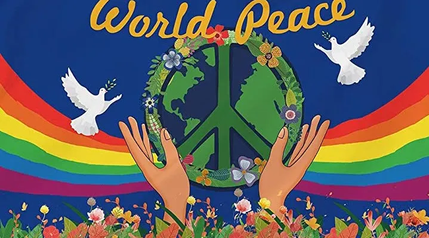
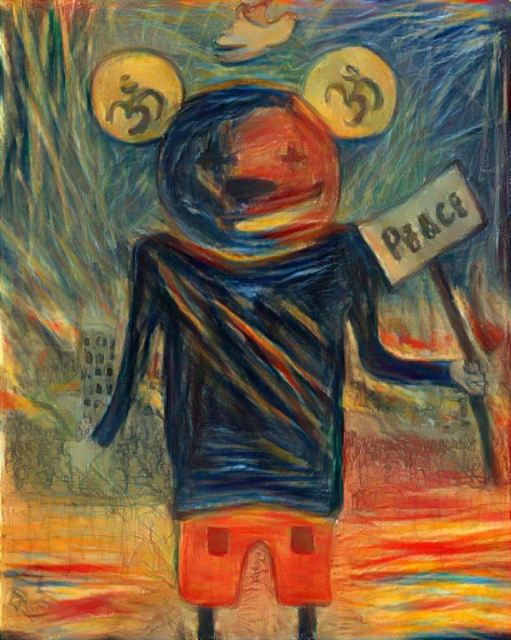
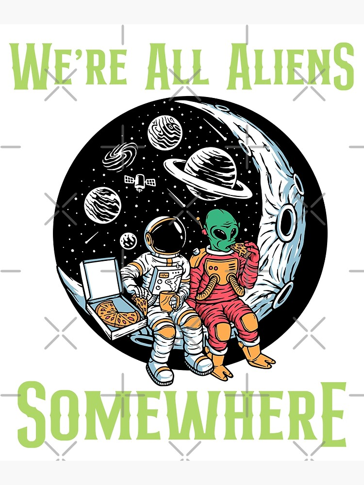

# The Coldplay

Every time I listened to [Coldplay](https://www.coldplay.com/), it always feels like there is a hope to humanity, hope of love, hope of faith, hope that you can do everything. Their songs always motivate me to become more humble, more helpful to others, more responsible as a global citizen, and be more human and help humanity.

For me their music denotes these 10 powerful causes to humanity:

- **Love:** Romantic, universal
- **Equality:** Rights, inclusion
- **Freedom:** Movements, solidarity
- **Environment:** Sustainability, impact
- **Justice:** Social, political
- **Connection:** Relationships, experiences
- **Growth:** Self-discovery, development
- **Hope:** Optimism, resilience
- **Unity:** Global, cultural
- **Empathy:** Understanding, compassion

## "This is the message I want to share with the world: Love, Peace, and Equality. Let's build a brighter future together."

> Love and compassion are necessities, not luxuries. Without them, humanity cannot survive.

Here are the list of the songs that I loved from them, I hope the readers will also love them:

| Song Name                      | Link                                                                        |
|--------------------------------|-----------------------------------------------------------------------------|
| Higher Power                   | [Listen](https://youtu.be/e-B7jMljhbk?si=sJY0fLkmL-eGIAlT)                |
| Adventure of a Lifetime        | [Listen](https://youtu.be/QtXby3twMmI?si=StXKKAIYxPEL3dWb)                |
| Paradise                       | [Listen](https://youtu.be/1G4isv_Fylg?si=z6WpXGiaNofxX8KH)                |
| The Scientist                  | [Listen](https://youtu.be/RB-RcX5DS5A?si=Z1net7McBtSRu5U-)                |
| Viva La Vida                   | [Listen](https://youtu.be/dvgZkm1xWPE?si=jt2jo09MlnAMHuZo)                |
| Hymn for the Weekend           | [Listen](https://youtu.be/YykjpeuMNEk?si=-sS0L_t2NHwZDyHx)                |
| Everglow                       | [Listen](https://youtu.be/xn_1hFdE-5g?si=5prM1F_2A_Mei-c6)                |
| Charlie Brown                  | [Listen](https://youtu.be/zTFBJgnNgU4?si=CmKRr-1ckRwXbxL0)                |
| Yellow                         | [Listen](https://youtu.be/yKNxeF4KMsY?si=lfezE13kgMKAVbqz)                |
| All My Love                    | [Listen](https://youtu.be/4NKhYkFAmUw?si=pDW-FRqK1cFsWNL1)                |
| People of the Pride            | [Listen](https://youtu.be/Q4nFTEsez5c?si=PIY2APlB4mu6h8i1)                |
| Clocks                         | [Listen](https://youtu.be/d020hcWA_Wg?si=bi_-b5kdicD5-BIP)                |
| We Pray                        | [Listen](https://youtu.be/knIbwsNGJyc?si=tUG-IJh6FYYUZJBm)                |
| Something Just Like This       | [Listen](https://youtu.be/FM7MFYoylVs?si=Jo0Zp4o2C_KdeNmS)                |
| My Universe                    | [Listen](https://youtu.be/3YqPKLZF_WU?si=Rvj4O6osJz88-Bfs)                |
| A Sky Full of Stars            | [Listen](https://youtu.be/VPRjCeoBqrI?si=wwFm963kIuYwskPQ)                |
| Green Eyes                     | [Listen](https://youtu.be/waKvorfmuB8?si=ZbBDCSsaSYe7mNT2)                |
| Sparks                         | [Listen](https://youtu.be/Ar48yzjn1PE?si=bzX9CIFjV0OCuktY)                |
| Fix You                        | [Listen](https://youtu.be/k4V3Mo61fJM?si=jKgNWSXEYyBdnXW-)                |
| Good Feelings                  | [Listen](https://youtu.be/2sdxKXfH84w?si=Qd2NuYZYbUrZ9bP7)                |
| Feels Like I'm Falling in Love | [Listen](https://youtu.be/V3IVdLo-2NM?si=9wyjKl2psJYyN9yo)                |

**If my message has touched your heart, I kindly ask you to take action and spread kindness. Make those around you happy and safe, respect the animals in your vicinity, and lend a helping hand to others.**

**Let's all be humble, show respect, and do our part to preserve and protect the nature that surrounds us.**

**If you believe in my cause, in the importance of humanity, nature, and love, please don't hesitate to reach out to me via my [email](mailto:itskanishkp.py@gmail.com) if you need any kind of help anytime.**

**With love,
Kanishk**
