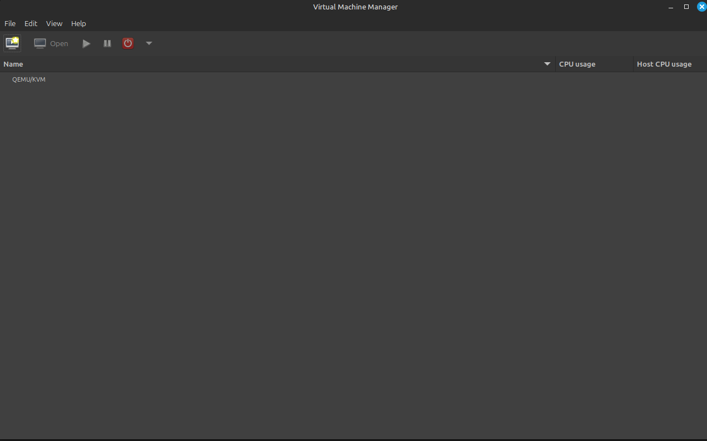
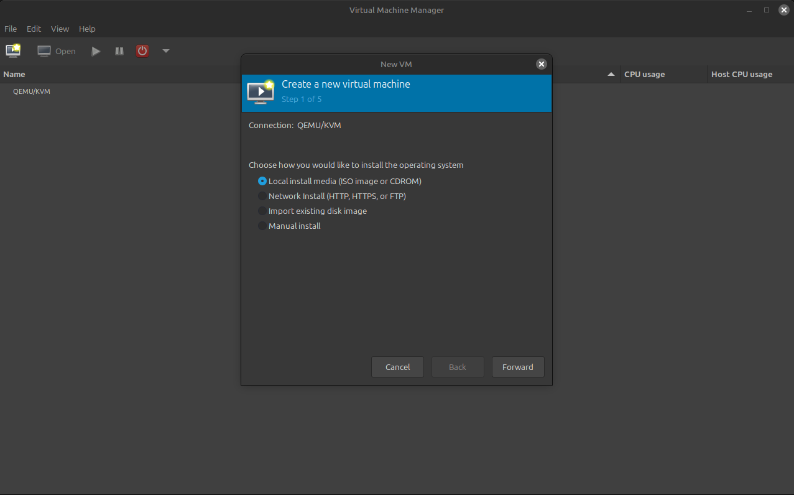
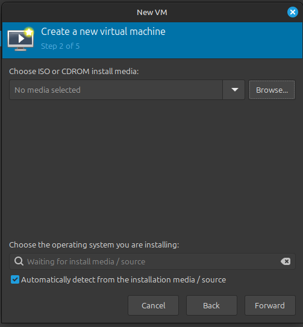
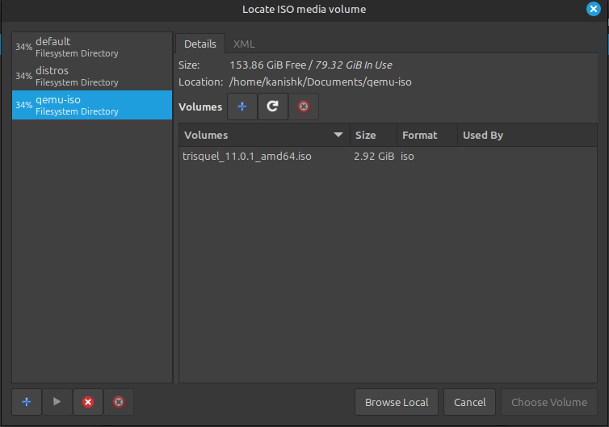
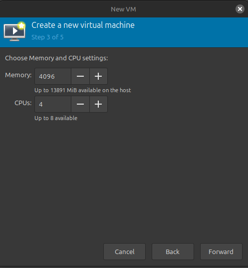
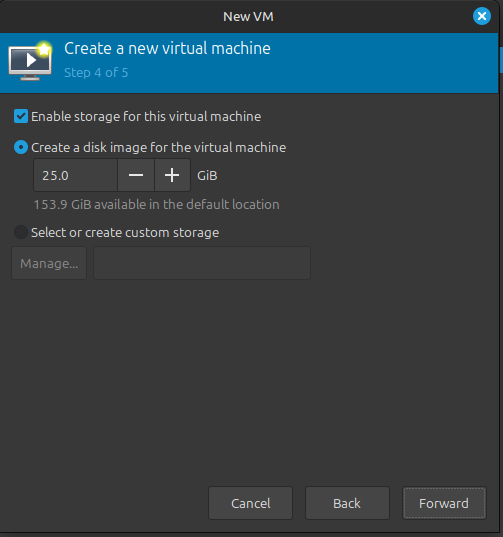
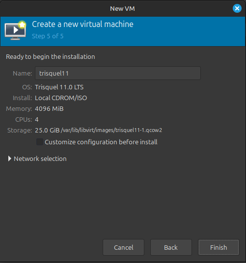
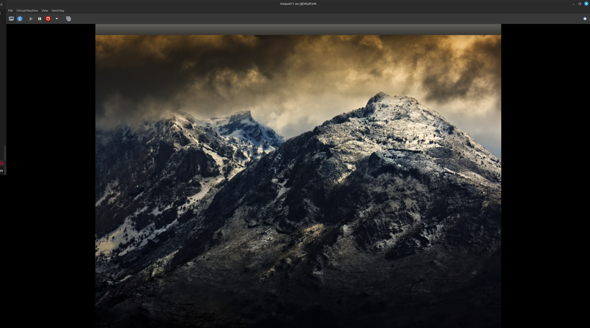

## What is QEMU/KVM ?

---
### Installation

For `Ubuntu` based system :- 

**Step 1**: Update the packages

```
sudo apt update
```

**Step 2:** Install `QEMU/KVM`

```
sudo apt install qemu-kvm
```

**Step 3:** Install `libvirt`

```
sudo apt install libvirt-daemon-system libvirt-clients
```

**Step 4:** Adding the user to `kvm` group

```
sudo usermod -aG kvm $USER
```

> **Note:** Restart the system so that the group changes may come in effect.

**Step 5:** List the groups that user belong to check it is added in the `kvm` group
```
groups $USER
```

- You'll see two new groups `kvm` and `libvirt` and your user is added to these groups.

**Step 6:** To verify and make sure `kvm` is correctly installed

```
virsh list --all
```
- This command will run successfully and list all the created virtual machine.
- *Currently it is empty, as we don't have any virtual machines created*

**Step 7:** Install `virt-manager` a graphical user interface to create virtual machines.

```
sudo apt install virt-manager
```

---
### Creating our first virtual machine using `virt-manager` gui

**Step 1:** Open Virtual Machine Manager



**Step 2:** Click on New VM button from the task-bar


- ***Above is the create new VM button***



- You can select your preferred way to load operating system ISO
- For this guide, I've downloaded the [trisquel gnulinux ISO](https://trisquel.info/) , so I'll select local install media option.

**Step 3:** Browse and Choose the ISO image path





**Step 4:** Choose memory and CPU settings
    


**Step 5:** Select the storage



**Step 6:** Confirm and create new Virtual Machine



---
#### Finally the newly created VM start


