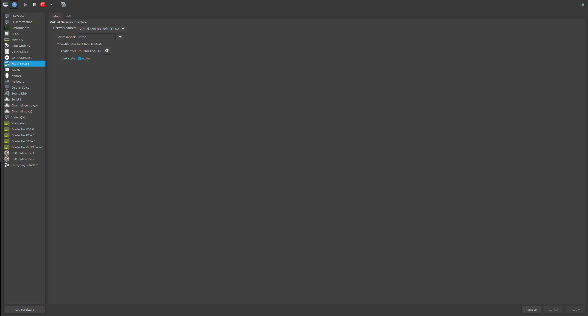
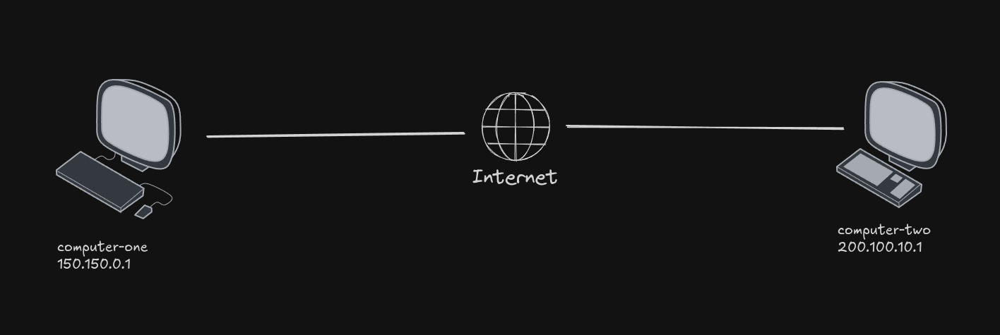
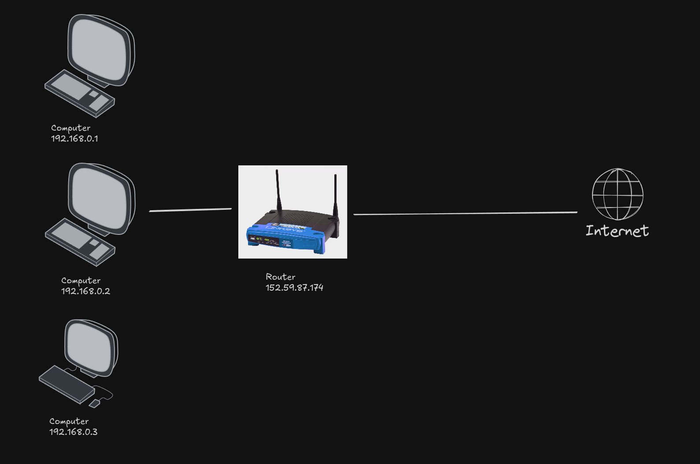
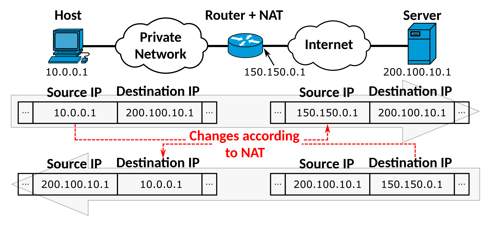
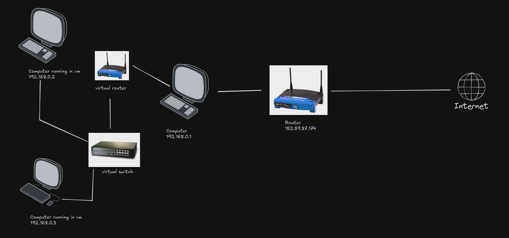
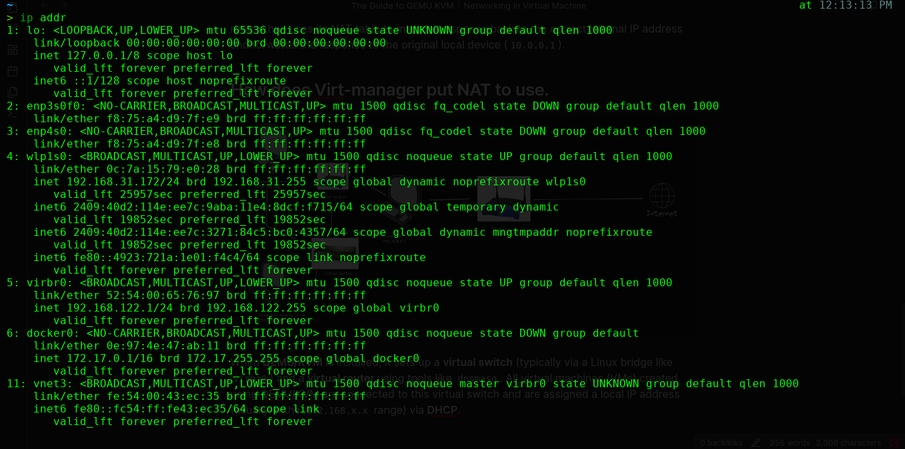

## What is Network address translation (NAT) ?

When we create a new virtual machine, it's default network interface is [NAT](https://en.wikipedia.org/wiki/Network_address_translation).



A Network interface interface allows us to connect our VM to the internet.

#### How does a device communicate to another device on the Internet ?



In the above Image when the computer-one (150.150.0.1) want to send some data to computer-two (200.100.10.1) on the Internet, it find the IP address of computer-two (200.100.10.1) which is connected on the Internet and sends the data to it. But not every computer in had a [public ip address](https://www.geeksforgeeks.org/computer-networks/what-is-public-ip-address/). 

They usually access the Internet via a [router](https://en.wikipedia.org/wiki/Router_(computing)) which had a public IP Address.



Each computer connected to a router has a local IP Address, like `192.168.X.X` or `10.0.X.X` and they are not exposed to the Internet. 

#### Working of Router + NAT in connecting a device to the Internet




When a device (like a computer or smartphone) wants to communicate with another device on the internet, it sends its request to the router. The router has two types of IP addresses:

When a local device (Host: `10.0.0.1`) sends data to a remote server on the internet (Server: `200.100.10.1`), the request is first sent to the router. The router uses **NAT (Network Address Translation)** to change the source IP address from the local device's IP (`10.0.0.1`) to the router's public IP address (`150.150.0.1`). The modified request is then sent to the destination server (`200.100.10.1`).

When the server responds, the response is sent to the router’s public IP (`150.150.0.1`). The router then uses its NAT table to map the response back to the correct internal IP address and forwards the response to the original local device (`10.0.0.1`).

## How does virt-manager put NAT to use.



When we create a new virtual machine using **virt-manager**, it automatically sets up a **NAT network** for the VM. This allows the VM to access the internet while keeping it isolated from the host machine's network.

When **QEMU/KVM** is installed, it sets up a **virtual switch** (typically via a Linux bridge like `virbr0`) and a **virtual router** using tools like `dnsmasq`. All virtual machines (VMs) created using QEMU/KVM are connected to this virtual switch and are assigned a local IP address (usually in the `192.168.x.x` range) via **DHCP**.

We can see the virtual router in our host machine network interface by using this command:

```
ip addr
```




In the output of the `ip addr` command:

- `virbr0` is the **virtual bridge** created by QEMU/KVM, acting like a virtual switch.
- `vnet3` (or `vnet0`, `vnet1`, etc.) is a **virtual network interface** representing the connection between the host and a specific running virtual machine. Each new VM gets its own `vnetX` interface.

> **Note:**
> 
> - Virtual machines can communicate with each other **only if** they are connected to the **same virtual network** (e.g., bridged via `virbr0`).
>  
> - If VMs are connected to **different networks**, they cannot communicate with each other.
>  
> - By default (in NAT mode), the **host machine cannot directly communicate with guest VMs**, and vice versa, unless specific routing or port forwarding is configured.

---
### Inspecting bridges with `brctl`

Installing `brctl`

   ```
sudo apt install bridge-utils
```

